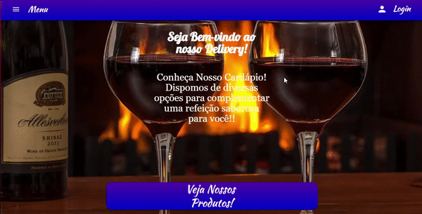

# Projeto LeChefe (Visualização)
<h3>Este é um projeto de delivery para restaurantes, este repositório é puramente demonstrativo na parte do  
front-end que fora feito inteiramente em Angular2, SCSS e HTML.<h3>

 

# Utilização
<h3><li> Geral </li></h3>
<h5> O sistema por si já tem suas funcionalidades e layouts organizados para funcionar como qualquer outro site de delivery,
você pode clicar no menu no header e ver o catálogo de produtos que estão preenchidos de maneira meramente demonstrativa. </h5>
 
<h3><li> Login (Usuário) </li></h3>
<h5> Ao clicar no icone de pessoa na parte de cima do site, um modal de login será aberto,
ao digitar qualquer coisa e clicar para entrar, você terá acesso aos menus e visão de usuario, que é a visão comum. </h5>
 
<h3><li> Login (Administrador) </li></h3>
<h5> Ao clicar no icone de pessoa na parte de cima do site, um modal de login será aberto,
ao digitar '123' para entrar, você terá acesso aos menus e visão de administrador, visão diferente e com mais elementos em relação a visão comum. </h5>

 
# Run

